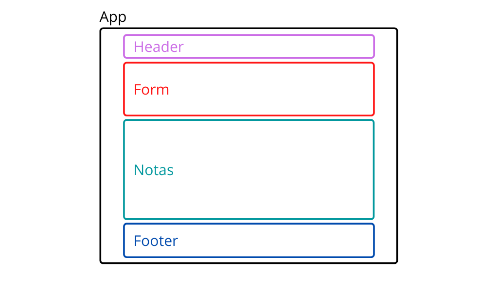

# Hello React

Una app para tomar notas, hecha en React y usando el _backend_ de [hello-crud](https://github.com/santiagotrini/hello-crud). Demo en [Heroku](https://react-notas.herokuapp.com).

## ¿Qué es React?

React es un _framework_ de JS para crear aplicaciones webs. Está orientado más que nada a crear SPAs (_Single Page Applications_). O sea una aplicación web que una vez descargada al navegador no requiere refrescar la página.

Según sus creadores de Facebook, React es
> Una biblioteca de JavaScript para crear interfaces de usuario

En React definimos los distintos elementos de una aplicación como **componentes**, y sus competidores principales son Angular y Vue que utilizan un enfoque distinto pero similar.

Un componente en React está formado por elementos. Un elemento en React tiene esta pinta.

```js
const element = <h1>Hello, world!</h1>;
```

Esta sintaxis que usa React es una extensión de JavaScript llamada JSX. Los componentes de React son funciones de JavaScript que pueden utilizar expresiones de JSX para definir elementos de la interfaz de usuario.

En general la sintaxis de los elementos en React es la de las etiquetas de HTML, pero JSX no es HTML y hay varias excepciones que vamos a ir viendo. La más conocida, para dar un ejemplo, es la del atributo `class` en un elemento.

En HTML tenemos

```html
<h1 class="text-center">Hola</h1>
```

Y en JSX en cambio usamos `className` porque `class` es una palabra reservada en JavaScript.

```js
<h1 className="text-center">Hola</h1>
```

Pero en general lo que funciona en HTML funciona en JSX.

Un componente en React puede escribirse como una función de JS.

```js
const Saludo = (props) => {
  return (
    <h1>Hola, {props.name}</h1>
  );
};
```

Esta función tiene que devolver un elemento de React, en el ejemplo de arriba un `<h1>` y puede recibir un objeto como argumento llamado convencionalmente `props` por propiedades.

La forma de usar las propiedades es similar a los atributos de HTML. Siguiendo con el ejemplo de arriba, el componente `Saludo` lo podemos usar en un componente que represente a toda la aplicación de la siguiente manera.

```js
const App = (props) => {
  return (
    <div>
      <Saludo name="Juan" />
    </div>
  )
};
```

El valor de `props.name` en Saludo en el caso de arriba será `'Juan'`.

Existen muchos conceptos más en React que iremos viendo mientras hacemos el proyecto. Para los más curiosos el mejor lugar para empezar a entender como funciona React es la [documentación oficial](https://es.reactjs.org/docs/hello-world.html).

## Creando el proyecto

En el artículo anterior creamos el _backend_ para una app de tomar notas.
Ese va a ser nuestro punto de partida.
Creamos una carpeta para este proyecto y copiamos todo lo que teníamos en [hello-crud](https://github.com/santiagotrini/hello-crud).

```console
$ mkdir hello-react
$ cd hello-react
$ git init
$ npm init -y
$ echo node_modules > .gitignore
$ echo web: npm start > Procfile
$ touch index.js
$ mkdir api
$ mkdir api/routes api/models
$ touch api/routes/note.js api/models/Note.js
```

Copien el código que ya tenían en los tres archivos de JavaScript: `index.js`, `api/models/Note.js` y `api/routes/note.js`.

Instalamos los paquetes de npm.

```console
$ npm i -D nodemon
$ npm i express morgan mongoose cors
```

Por último agregamos los scripts al `package.json`.

```json
"scripts": {
  "dev": "nodemon index.js",
  "start": "node index.js"
}
```

Antes de empezar con el _frontend_ probamos que todo funcione como antes.

```console
$ npm run dev
```

Si todo anduvo bien entonces ahora sí podemos crear la aplicación de React. Para eso vamos a usar [Create React App](https://create-react-app.dev/docs/getting-started/) que es una herramienta de línea de comandos para crear rápidamente una nueva app de React.

```console
$ npx create-react-app client
$ cd client
$ npm start
```

Con Create React App nos ahorramos el dolor de cabeza de tener que configurar Webpack y otras cosas necesarias para que todo funcione.

A partir de ahora vamos a trabajar en el directorio `client` donde va a estar el código relativo al _frontend_. Si todo anduvo bien deberían ver en `localhost:3000` el logo de React girando.

## Concurrently

Primero tenemos un problema que resolver, si ejecutamos `npm start` desde el directorio `client` solo tenemos el _frontend_ ejecutándose.

Si hacemos `npm start` o `npm run dev` desde la carpeta del proyecto en cambio tenemos el _backend_. Queremos las dos cosas juntas.

Lo ideal sería ejecutar `npm run dev` desde el directorio principal y tener las dos cosas juntas. Por suerte existe un paquete en npm que resuelve este problema, lo instalamos. Pero lo hacemos desde el directorio raíz del proyecto, es decir parados en `hello-react`.

```console
[~/hello-react]$ npm i -D concurrently
```

Para usar Concurrently modificamos el `package.json` del _backend_.
La sección de scripts en `hello-react/package.json` tiene que quedar así.

```json
"scripts": {
  "server": "node index.js",
  "client": "npm start --prefix client",
  "start": "node index.js",
  "dev": "concurrently \"npm run server\" \"npm run client\""
}
```

Entonces con `npm run dev` ahora tenemos el cliente y el servidor al mismo tiempo. Excepto por un problema, tanto servidor como cliente quieren recibir conexiones en el puerto 3000. Lo arreglamos cambiando el puerto en `hello-react/index.js` por 4000 o alguna otra cosa.

El último paso para que todo funcione es ir a `client/package.json` y agregar la siguiente propiedad:

```json
"proxy": "http://localhost:4000",
```

Esto es necesario para que el cliente pueda realizar peticiones a la API del server. Ahora sí ya estamos listos para empezar con el código del _frontend_. Veamos un poco más en detalle los archivos que Create React App creó en el directorio `client`.

## Estructura del proyecto

El directorio `client` se podría considerar un proyecto de NodeJS dentro de nuestro proyecto original que era el server para esta aplicación web. Dentro de `client` tenemos también un `package.json`, podemos instalar dependencias para el _frontend_ que irán a `client/node_modules`.

Después de eliminar algunos archivos innecesarios tenemos lo siguiente dentro de `client`.

```
.
├── node_modules
├── .gitignore
├── package.json
├── package-lock.json
├── public
│   ├── favicon.ico
│   ├── index.html
│   ├── manifest.json
│   └── robots.txt
└── src
    ├── App.js
    ├── index.js
    └── serviceWorker.js
```

En general vamos a editar y crear archivos en `src`, por _source code_ o código fuente. Menos frecuentemente puede ser que editemos algo en `public`.

La cosa funciona así, el archivo `client/index.js` es el punto de entrada del _frontend_. En general ese archivo lo que hace es montar el componente que representa a toda la app en un `div` con `id="root"` en `public/index.html`. El componente principal de la app está definido generalmente en un archivo llamado `App.js` que pueden encontrar en el directorio `src`.

## Agregando dependencias

Para esta app vamos a usar Bootstrap y Font Awesome. Además vamos a usar un paquete de npm llamado Axios para realizar peticiones HTTP a la API en el _backend_.

Para instalar dependencias en React usamos npm pero desde el directorio `client`.

```console
$ npm i axios bootstrap
```

Para poder usar las clases de Bootstrap en JSX vamos a `client/src/index.js` y agregamos el siguiente import.

```js
import 'bootstrap/dist/css/bootstrap.css';
```

Para usar Font Awesome lo linkeamos directamente desde un CDN en `client/public/index.html`. En el `head` agregamos

```html
<link rel="stylesheet" href="https://cdnjs.cloudflare.com/ajax/libs/font-awesome/4.7.0/css/font-awesome.min.css">
```

## Los componentes de la app

Para pensar en React tenemos que pensar en qué componentes vamos a dividir la aplicación. La app es un _frontend_ para la API que hicimos en `hello-crud`. O sea queremos poder ver, crear, editar y eliminar notas.

La siguiente imagen ilustra lo que se me ocurrió a mí.



Un _header_ y un _footer_. Un formulario para agregar una nota y un contenedor en el centro para mostrar todas las notas. Todo eso dentro de un componente que representa toda la app.

Necesitamos archivos para cada componente, así que dentro de `client/src` hacemos

```console
$ touch Footer.js Header.js NoteForm.js NotesList.js Note.js
```

No hace falta crear `App.js` porque ya lo creó Create React App. Las notas las vamos a mostrar con dos componentes. `NotesList.js` para agrupar todas las notas y `Note.js` es el componente que representa cada nota individual. El componente `NoteForm.js` es el formulario que me permite agregar una nota nueva.

Vamos viendo el código componente por componente.

## Footer

```js
import React from 'react';

// footer component
const Footer = () => {
  return (
    <div className="text-center mb-3">
      <hr />
      <h4 className="text-muted">Hello React</h4>
      <a href="https://github.com/santiagotrini/hello-react">
        <i className="fa fa-github fa-3x text-dark"></i>
      </a>
    </div>
  );
};

export default Footer;
```

El _footer_ es el componente más simple. Solo tiene que importar React en la primera línea y es una función que devuelve JSX. No se olviden de exportar el componente con `export default` al final del archivo para poder usarlo después en `App.js`.

Noten el uso de `className` en vez de `class` para darle estilo con Bootstrap.

## Header

El próximo componente usa `props`. El _header_ recibe el título como propiedad.

```js
import React from 'react';

const Header = ({ title }) => {
  return (
    <nav className="justify-content-center navbar navbar-expand-lg navbar-dark bg-dark">
      <a className="navbar-brand" href="/#">{title}</a>
    </nav>
  );
};

export default Header;
```

Para usar `props` en los elementos de JSX o en general cualquier expresión de JavaScript tenemos que encerrarla en `{}`. En el ejemplo tenemos `{title}` como el contenido del elemento `<a>`.

Para probar lo que tenemos hasta ahora y verlo en el navegador tenemos que modificar el componente App en `App.js`.

```js
// imports
import React from 'react';
import Header from './Header';
import Footer from './Footer';

const App = () => {
  return (
    <div>
      <Header title='Notas'/>
      <Footer />
    </div>
  );
};

export default App;
```

Noten que tenemos que encerrar a Header y Footer en un `<div>` porque un componente de React solo puede devolver un único elemento. Pero ese elemento puede contener a su vez otros elementos.

También se puede ver como importamos los componentes Header y Footer con `import` al inicio del archivo.

## Componentes con estado

Hasta ahora los dos componentes que vimos no tienen estado. El Header tiene `props` pero las propiedades funcionan como valores que no cambian, se establecen al momento de crear el componente.

Si queremos un componente con valores que puedan cambiar necesitamos componentes con estado. El componente App por ejemplo mantiene una lista (_array_) con todas las notas de la app.

Para esto hacemos uso del _hook_ `useState` que nos da React.

```js
// imports
import React, { useState } from 'react';
import Header from './Header';
import Footer from './Footer';

const App = () => {

  // useState hook (las notas de la lista)
  const [notes, setNotes] = useState([]);

  // render JSX
  return (
    <div>
      <Header title='Notas'/>
      <div className="container mt-3">

      </div>
      <Footer />
    </div>
  );
};

// export
export default App;
```

La línea `const [notes, setNotes] = useState([]);` es donde usamos el _hook_ y obtenemos dos variables. En `notes` vamos a tener inicialmente un _array_ vacío. Y en `setNotes` tenemos una función que nos permite cambiar el valor de `notes`. Con la variable `notes` ya podemos empezar a escribir las funciones para realizar el CRUD en React.

## ABM de notas

Seguimos en `App.js`. Importamos `axios` para realizar las _requests_ a la API y agregamos tres funciones para crear, actualizar y borrar una nota del _array_ `notes`.

```js
// imports
import React, { useState } from 'react';
import axios from 'axios';
import Header from './Header';
import Footer from './Footer';

const App = () => {

  // useState hook (las notas de la lista)
  const [notes, setNotes] = useState([]);

  // funciones del CRUD
  // crear nota
  const addNote = note => {
    axios.post('/api/notes', note)
      .then(res => {
        const newNotes = [res.data, ...notes];
        setNotes(newNotes);
      });
  };

  // update note
  const updateNote = (id, title, text) => {
    const updatedNote = {
      title: title,
      text: text
    };
    axios.put('/api/notes/' + id, updatedNote)
      .then(res => {
        const newNotes = notes.map(note =>
          note.id === id ? updatedNote : note
        );
        setNotes(newNotes);
      });
  };

  // delete note
  const removeNote = (id) => {
    axios.delete('/api/notes/' + id)
      .then(res => {
        const newNotes = notes.filter(note => note._id !== id);
        setNotes(newNotes);
    });
  };

  // render JSX
  return (
    <div>
      <Header title='Notas'/>
      <div className="container mt-3">
        <NoteForm
          addNote={addNote}
        />
      </div>
      <Footer />
    </div>
  );
};

// export
export default App;
```

El uso de Axios no requiere demasiada explicación. La sintaxis es `axios.METHOD(URL, DATA)` y eso devuelve una promesa, o sea podemos encadenar un `.then()` con una _callback_ dentro que se va a ejecutar cuando llegue la respuesta del servidor.

En `addNote()` recibimos como argumento un objeto que representa una nota y después de agregarla a la base de datos a través de la API usamos `setNotes()` para modificar el _array_ de notas. En esta función usamos el operador `...` conocido como _spread operator_ para crear un nuevo array con todos los elementos de notas más la nota recién creada al principio.

En `updateNote()` recibimos como argumentos el ID, el título y el texto de la nota a modificar. Después de recibir la respuesta del servidor usamos `notes.map()` para devolver un _array_ idéntico a `notes` excepto por la posición que modificamos.

En `deleteNote()` usamos el ID de la nota para hacer la petición a la API y modificamos el _array_ de notas con `notes.filter()` que devuelve un array con todos los elementos que cumplan con la condición `note._id !== id`.

En el `return` de App agregué un `<div>` que hace de contenedor de Bootstrap y el componente NoteForm. Por ahora va a dar error porque no tenemos nada en `NoteForm.js`.

## NoteForm

En este componente vamos a armar un formulario para agregar notas. Vamos a recibir como propiedad la función `addNote` desde App.

```js
import React, { useState } from 'react';

const NoteForm = ({ addNote }) => {

  // state hooks para el form
  const [title, setTitle] = useState('');
  const [text, setText] = useState('');

  // handler para el submit
  const handleSubmit = e => {
    e.preventDefault();
    addNote({
      title: title,
      text: text
    });
    // blanquear formulario
    setTitle('');
    setText('');
  };

  // render JSX
  return (
    <form onSubmit={handleSubmit}>
      <div className="form-group">
        <label htmlFor="title">Título</label>
        <input
          id="title"
          className="form-control"
          type='text'
          value={title}
          onChange={e => setTitle(e.target.value)}
        />
      </div>
      <div className="form-group">
        <label htmlFor="text">Texto</label>
        <textarea
          id="text"
          className="form-control"
          value={text}
          rows="4"
          onChange={e => setText(e.target.value)}
        >
        </textarea>
      </div>
      <input
        className="btn btn-primary"
        type="submit"
        value="Guardar"
      />
    </form>
  );
};

export default NoteForm;
```

En este componente definimos dos _hooks_ de estado, uno para cada _input_ del formulario que tiene un `<input type="text">` y un `<textarea>` para el título y el texto de la nota. Usamos el evento `onChange` en cada _input_ para setear el estado y usamos una función llamada `handleSubmit` como acción cuando enviamos el formulario.

Lo que hace `handleSubmit` es llamar a `addNote` con los datos del formulario. Si bien `addNote` era una función de App acá la tenemos disponible porque la pasamos como `prop`. Antes de que termine `handleSubmit` blanqueamos el formulario con `setTitle('')` y `setText('')`.

## La lista de notas y useEffect

Para armar la lista de notas vamos a usar dos componentes. El primero representa la lista con todas las notas, el segundo una nota individual.
Para traer los datos de las notas de la base de datos tenemos que hacer una petición a la API con Axios apenas cargue la aplicación.

Para este tipo de _requests_ podemos usar el _hook_ `useEffect` en React. Este _hook_ se ejecuta cuando un componente termina de renderizarse. La función que le pasamos a `useEffect` la vamos a usar para realizar la petición en el componente App y actualizar su estado, es decir, el _array_ que guarda las notas. Ahora `App.js` quedaría así.

```js
// imports
import React, { useState, useEffect } from 'react';
import axios from 'axios';
import Header from './Header';
import NotesList from './NotesList';
import NoteForm from './NoteForm';
import Footer from './Footer';

const App = () => {

  // useState hook (las notas de la lista)
  const [notes, setNotes] = useState([]);

  // useEffect hook (para fetchear la data al cargar)
  useEffect(() => {
    axios.get('/api/notes')
      .then(res => {
        setNotes(res.data.notes);
      });
  }, []);

  // CRUD functions
  // crear nota
  const addNote = note => {
    axios.post('/api/notes', note)
      .then(res => {
        const newNotes = [res.data, ...notes];
        setNotes(newNotes);
      });
  };

  // actualizar nota
  const updateNote = (id, title, text) => {
    const updatedNote = {
      title: title,
      text: text
    };
    axios.put('/api/notes/' + id, updatedNote)
      .then(res => {
        const newNotes = notes.map(note =>
          note.id === id ? updatedNote : note
        );
        setNotes(newNotes);
      });
  };

  // eliminar nota
  const removeNote = (id) => {
    axios.delete('/api/notes/' + id)
      .then(res => {
        const newNotes = notes.filter(note => note._id !== id);
        setNotes(newNotes);
    });
  };

  // render JSX
  return (
    <div>
      <Header title='Notas'/>
      <div className="container mt-3">
        <NoteForm
          addNote={addNote}
        />
        <hr />
        <NotesList
          notes={notes}
          removeNote={removeNote}
          updateNote={updateNote}
        />
      </div>
      <Footer />
    </div>
  );
};

export default App;
```

Ya con esto `App.js` está terminado. Noten que `useEffect` lleva dos argumentos. El primero es una _callback_ que se ejecuta cuando el componente termina de actualizar la UI, el segundo es un _array_ con variables. En ese _array_ podemos poner variables, y cuando esas variables cambian el _hook_ vuelve a dispararse. Para evitar que el _hook_ se ejecute infinitamente le pasamos un _array_ vacío.

También actualizamos el JSX en el `return`, ahora ponemos un `<hr>` después del formulario y el componente NotesList. NotesList recibe `props` de App, el _array_ de notas y las funciones para eliminar y modificar una nota. Todavía no tenemos el código de `NotesList.js` así que es normal que dé error en este punto.

El componente NotesList sería algo así.

```js
import React from 'react';
import Note from './Note';

const NotesList = ({ notes, removeNote, updateNote }) => {

  // render JSX
  return (
    <div className="card-columns">
      {notes.map((note) => (
        <Note
          id={note._id}
          key={note._id}
          initialTitle={note.title}
          initialText={note.text}
          removeNote={removeNote}
          updateNote={updateNote}
        />
      ))}
    </div>
  );
};

export default NotesList;
```

NotesList es un `<div>` que utiliza el componente Note internamente, por eso lo importa en la segunda línea. Usamos `notes.map()` para iterar sobre el _array_ de notas y crear un componente Note por cada nota. Cada componente Note recibe `props` de NotesList: el ID, título y texto, así como las funciones `removeNote` y `updateNote`.

Cuando hacemos listas de componentes en React la librería nos pide que pasemos una propiedad llamada `key` que sea única para cada componente en la lista. Podemos usar el ID de cada nota para esto.

## Note.js

Bueno, solo nos falta el componente Note. Copio el código y luego lo explico.

```js
import React, { useState } from 'react';

const Note = ({ id, initialTitle, initialText, removeNote, updateNote }) => {

  // note title state
  const [title, setTitle] = useState(initialTitle);
  // note text state
  const [text, setText] = useState(initialText);
  // editable state
  const [editable, setEditable] = useState(false);

  // handlers
  // save handler
  const handleSave = () => {
    updateNote(id, title, text);
    setEditable(!editable);
  };

  // CSS override de bootstrap
  const inputStyle = {
    backgroundColor: 'transparent',
    border: 'none',
    fontSize: 1.25+'rem',
    marginBottom: 0.75+'rem'
  };
  const textareaStyle = {
    backgroundColor: 'transparent',
    border: 'none'
  };

  // render JSX
  return (
    <div className="card">
      <div className="card-body">

        <input
          style={inputStyle}
          spellCheck={false}
          disabled={!editable}
          value={title}
          onChange={(e) => setTitle(e.target.value)}
        />

        <textarea
          rows={5}
          style={textareaStyle}
          spellCheck={false}
          disabled={!editable}
          value={text}
          onChange={(e) => setText(e.target.value)}
        >
        </textarea>
        <br />

        <button className="btn" hidden={editable} onClick={() => setEditable(!editable)}>
          <i className="text-secondary fa fa-pencil fa-lg"></i>
        </button>

        <button className="btn" hidden={!editable} onClick={handleSave}>
          <i className="text-secondary fa fa-save fa-lg"></i>
        </button>

        <button className="btn" onClick={() => removeNote(id)}>
          <i className="text-danger fa fa-trash fa-lg"></i>
        </button>

      </div>
    </div>
  );
};

export default Note;
```

Cada nota es una _card_ de Bootstrap, un `<div className="card">`. Cada una de estas tarjetas contiene _inputs_ para el título y el texto y dos botones: editar y eliminar. Al presionar el botón de editar podemos cambiar el título y el texto de la nota y vemos un botón de guardar.

Cada una de estas notas tienen estado, así que usamos `useState` para definir tres variables de estado. El título, el texto y si la nota es editable o no. El estado de "ser editable" lo cambiamos al usar el botón de editar y guardar.

Cuando la nota es editable usamos `setText` y `setTitle` con el _listener_ `onChange` para cambiar el estado a medida que tipeamos. Podemos usar el atributo `disabled` para que los _inputs_ estén desactivados y no sean editables hasta presionar el botón de editar.

Las funciones asociadas a cada botón se disparan usando el _listener_ `onClick`. Cuándo la función tiene una sola línea podemos escribirla directamente ahí como en `onClick={() => remoteNote(id)}`. Si la función fuera más complicada podemos escribirla fuera del `return` y pasar el nombre como en el caso de `onClick={handleSave}`.

Usamos íconos de Font Awesome para los botones (los _tags_ `<i>`) y también usamos el atributo `style` en los _inputs_ para sobreescribir los estilos por defecto de Bootstrap, para que el `<input>` y el `<textarea>` no se vean como salen generalmente en un formulario. Noten que para escribir CSS usando el atributo `style` tenemos que escribir las propiedades y sus valores como si fueran objetos de JS y en _camelCase_ en vez de _kebab-case_ como en CSS.

Por ejemplo, si queremos cambiar el color de fondo, en CSS:

```css
p {
  background-color: red;
}
```

En React

```js
<p style={{ backgroundColor: 'red' }}>Lorem ipsum</p>
```

Y con esto debería estar terminado el _frontend_ en React. Faltaría compilar y hacer el _deploy_.

## Build & deploy

Antes de hacer el _deploy_ de la app tenemos que compilarla. Hasta ahora la app que estabamos viendo mientras desarrollamos en `http://localhost:3000` era una versión de desarrolo. Para compilar la app de React y convertirla en _static assets_ usamos desde el directorio `client` el _script_ `build`.

```console
$ npm run build
```

Esto produce una versión lista para hacer el _deploy_ en el directorio `client/build`. Podemos usar el `index.js` de nuestro _backend_ para servir la app. Pero primero creamos un directorio `public` en nuestro proyecto y movemos todo el contenido de `hello-react/client/build` a `hello-react/public`.

Ahora sí, en `hello-react/index.js` agregamos

```js
// imports
// path es un modulo base de NodeJS, no hay que instalarlo con npm
const path = require('path');
// mas imports ...

// codigo ...

// despues de conectarse a la base de datos
app.use(express.static('public'));
app.get('/', (req, res) => {
  res.sendFile(path.join(__dirname, 'public', 'index.html'));
});
```

Y con esto le decimos a nuestra app de Express que envíe el `index.html` para la ruta `/` de nuestro server. Todos los _assets_ estáticos de la app están en `public`, por eso usamos `express.static('public')`.

Subir esto a Heroku es exactamente igual que lo que hicimos con [hello-database](https://github.com/santiagotrini/hello-database).

1. Suben el código a GitHub
2. Crean la app en Heroku
3. Crean una base de datos en MongoDB Atlas
4. Setean `MONGODB_URI` en las _config vars_ de Heroku
5. Conectan el repo de GitHub a su app de Heroku y listo

Y listo con esto terminamos y tenemos nuestra primer _web app_ con el _stack_ MERN :tada:!
